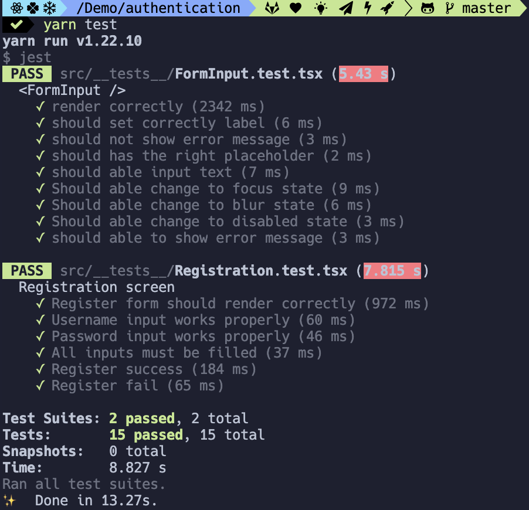

# React native and nodejs authentication demo

## Functions

- Register user account
- Use SendGrid to send email with confirmation code to the user
- Implement unit and integration tests at [here](src/__tests__)

## Backend

- Repo: https://github.com/hoanganhx86/nodejs-jwt-authentication-sample

- Deployed to heroku at: https://nodejs-auth1.herokuapp.com/

## Demo

## Prerequisites

### Install dependencies

Run those commands to install all the dependencies needed

    yarn install
    yarn pod:install

## Ready for development

At the root folder of project

### Run iOS app

    yarn ios

### Run Android app

First need to start an emulator

    yarn android

## Testing

To run all the tests

    yarn test

## Github workflow

Will run linting check code quality and run all the tests automatically
